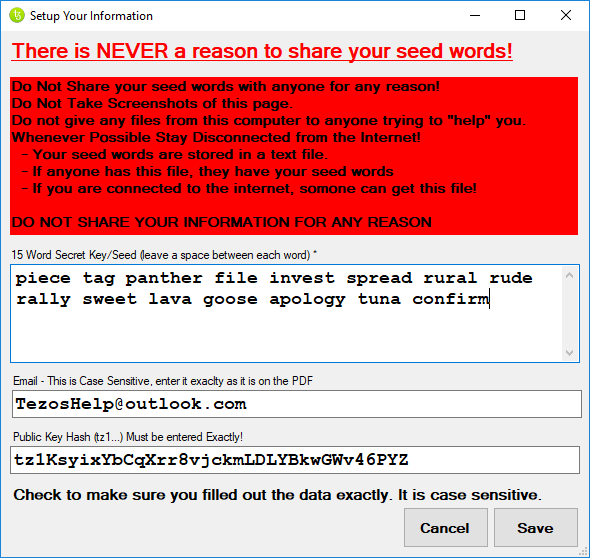

# Tezos Passord Cracker For Windows
A Windows application that aids in the recovery of lost Tezos ICO passwords. 

## Getting Started

You will need to install Python before you begin.

Step 1: Download the Python Installer: https://www.python.org/downloads/release/python-373/

Setp 2: When Installing be sure to check "Add Python 3.7 to PATH" 

Setp 3: Depending on your machine, the installer may ask you to extend your PATH limitations. This should be OK to do if you need to do it. 

Step 4: [Download the most recent release](https://github.com/LordDarkHelmet/TezosPassordCrackerForWindows/releases) 

Step 5: Unzip the downloaded release to a directory of your choosing then double click on the installer 

Step 6: Click Install 

Step 7: The application should automatically launch. You can always launch it from the start menu or the icon placed on your desktop 

Step 8: Click on the Edit Information Button to start. 

Step 9: Enter the information found on your contribution PDF. DO NOT SHARE THIS INFORMATION WITH ANYONE! 

Step 10: Use one of the options to crack your password. I recomend using masks.
 
## Need More Assistance?

This application was requested by members of the Tezos XTZ Recovery Telegram Group.  
For Tezos recovery assistance please visit: https://t.me/xtzrecovery 

Feel free to contact me for requests or assistance

The backend is using John The Ripper, see https://github.com/magnumripper/JohnTheRipper  
That means that all of the options for JTR are avalible to you!

### Donations are welcome:
BTC:   33DxcicBuN7wvqByLfmHH9FC9AvuEa3cGh  
Tezos: tz1WYZrE1Lhd5cgh4vzUhJB1UBNGEdekbskQ
